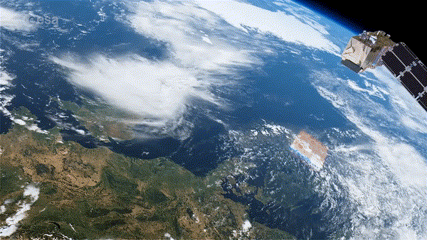

# __preprocS2__ 

# A R package dedicated to basic preprocessing of Sentinel-2 Level-2A reflectance images

[](https://www.r-project.org/Licenses/GPL-3)
[](https://gitlab.com/jbferet/preprocS2/pipelines/latest)


# preprocS2

The goal of preprocS2 is to provide a common framework for teh preprocessing of Level-2A Sentinel-2 images. 
Sentinel-2 L2A images can be produced or obtained from various data hubs or atmospheric correction methods. `preprocS2` provides a unique function to read, crop, resample the original image directory, and write it as a raster stack. 


## Installation

After installing package `devtools`, you need to install the package `preprocS2` with the following command line in R session:
```
devtools::install_gitlab('jbferet/preprocS2')
```

## Example

A tutorial vignette is available [here](https://jbferet.gitlab.io/preprocS2/articles/preprocS2.html).

Sentinel-2 data can be accessed via various hubs including: 

- [Copernicus Open Access Hub](https://scihub.copernicus.eu/), which provides complete, free and open access to Sentinel-2 data
- [PEPS](https://peps.cnes.fr/rocket/#/home), la 'Plateforme d'Exploitation de Produits Sentinel' 
- [THEIA](https://theia.cnes.fr/atdistrib/rocket/#/search?collection=SENTINEL2)

`preprocS2` does not aim at performing atmospheric corrections, and it expects [Level 2A Sentinel-2 products](https://sentinels.copernicus.eu/web/sentinel/user-guides/sentinel-2-msi/product-types/level-2a) delivered by an atmospheric correction algorithm, such as 
- [Sen2Cor](http://step.esa.int/main/snap-supported-plugins/sen2cor/)
- [MAJA](https://www.theia-land.fr/en/product/sentinel-2-surface-reflectance/)
- [LaSRC](https://www.sciencedirect.com/science/article/pii/S0034425718304139)
